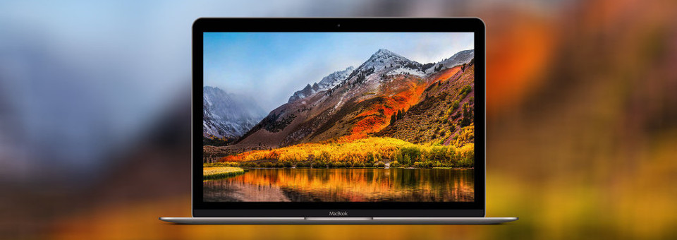

<!--
  * browser: macos-defaults
  * tracker: 53234c0656a865384b1e2afb715aec91
  * version: 4.0.0
  * updated: 2022-06-23T00:00:00Z
  * contact: Joel Parker Henderson (http://joelparkerhenderson.com)
  * options: commentable
-->

# macos-defaults setup configuration script

The `macos-defaults` script configures Apple macOS system software preferences, by using the macOS command `defaults`.

For example: 

  * Show all filename extensions.
  * Set a fast keyboard repeat rate.
  * Automatically hide and show the Dock.

These preferences are our team's preferences for our professional software developers.

You may prefer to edit this script to set your own personal preferences.

## Usage

To download the script and run it:

    curl https://raw.githubusercontent.com/SixArm/macos-defaults/master/macos-defaults | zsh

## Thanks

  * https://github.com/mathiasbynens/dotfiles
  * https://github.com/stianeikeland/dotfiles/edit/master/bin/sanemacdefaults.sh
  * https://www.taniarascia.com/setting-up-a-brand-new-mac-for-development/

